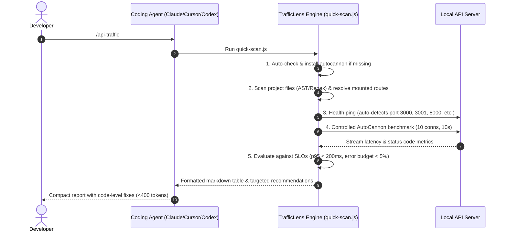

# TrafficLens — Agent Skill for API Performance & Traffic Profiling

[](https://skills.sh/hemanshulabs/trafficlens)
[](LICENSE)
[]()

> **Turn API traffic into instant root-cause diagnoses.** An installable Agent Skill for **Claude Code**, **Cursor**, **Codex**, **Gemini CLI**, and **OpenCode**. Triggered with `/api-traffic`.

---

## ⚡ What is TrafficLens?

Instead of manually crafting `curl` loops or parsing giant load-test outputs, TrafficLens gives your AI coding assistant an automated, hands-on operational runbook:

1. 🔍 **Auto-detects API routes** across popular frameworks (Express, Fastify, Next.js App & Pages Router, NestJS, Hono, Koa).
2. ⚡ **Runs safe, controlled AutoCannon benchmarks** against active local endpoints.
3. 📊 **Measures latency percentiles** ($p50$, $p95$, $p99$), throughput ($RPS$), and error rates.
4. 🛠️ **Delivers actionable diagnostics** directly in chat with root-cause identification and code-level fixes (< 400 tokens).

---

## 🚀 Quick Install (30 Seconds)

### Option 1: Vercel Skills (`skills.sh`) — Recommended for All Agents
Works with **Claude Code**, **Cursor**, **GitHub Copilot**, **Codex**, and **OpenCode**:

```bash
npx skills@latest add hemanshulabs/trafficlens
```

### Option 2: Claude Code Native Plugin

Install via the Claude Code CLI:

```bash
claude plugins install trafficlens-skills
```

Or run directly inside an active Claude Code conversation:

```
/plugin install trafficlens-skills
```

---

## 💻 How to Use

Start your local backend development server (e.g. `npm run dev`), then ask your agent:

```text
> /api-traffic
```

You can also invoke it conversationally:
* *"Benchmark my API routes and find slow endpoints"*
* *"Run a load test against checkout"*
* *"Are there any endpoints exceeding our 200ms latency budget?"*

---

## 📋 Example Report

When triggered, your agent will execute the background test and present a concise summary:

```markdown
## 🚦 TrafficLens API Performance Report

**Target:** `http://localhost:3000` | **Routes Tested:** 5 | **Load:** 10 conns (10s/route)

| Route | Method | RPS | p50 | p95 | p99 | Errors | Status |
| :--- | :--- | :---: | :---: | :---: | :---: | :---: | :---: |
| `/api/products` | `GET` | 2,410 | 2ms | 6ms | 11ms | 0 | ✅ Healthy |
| `/api/products/:id` | `GET` | 2,890 | 1ms | 4ms | 7ms | 0 | ✅ Healthy |
| `/api/config` | `GET` | 2,120 | 1ms | 5ms | 8ms | 0 | ✅ Healthy |
| `/api/search` | `POST` | 310 | 45ms | 110ms | 185ms | 0 | ✅ Healthy |
| `/api/checkout` | `POST` | 3 | 2.6s | 2.8s | 3.1s | 1 | 🔴 Slow |

### ⚠️ Bottlenecks & Fix Recommendations

* **🔴 `POST /api/checkout`** — p95 2800ms exceeds 500ms SLO (+460%)
  * *Root cause:* Synchronous blocking payment wait or unindexed database query.
  * *Fix:* Move order fulfillment to a background worker or add an index on the orders table.
* **🟡 `GET /api/config`** — High repetition static response.
  * *Recommendation:* Add HTTP `Cache-Control: public, max-age=60` to save up to 80% database load.
```

---

## 🏗️ Architecture & How It Works



---

## 📂 Skill Repository Structure

```text
Trafficlens/
├── .claude-plugin/
│   ├── plugin.json                 # Claude Code plugin manifest
│   └── marketplace.json            # Plugin marketplace catalog
├── skills/
│   └── api-traffic/
│       ├── SKILL.md                # Main skill runbook (Phases 1–4)
│       ├── agents/
│       │   └── openai.yaml         # Codex CLI interface metadata
│       ├── scripts/
│       │   ├── quick-scan.js       # Fast, zero-dep discovery & benchmark runner
│       │   ├── discover-routes.js  # Framework router parser (Express, Next.js, etc.)
│       │   └── run-analysis.js     # Standalone AutoCannon result evaluator
│       └── references/
│           └── detection-rules.md  # Production SLO guidelines & cache formulas
├── SKILL.md                        # Root skill manifest for direct repo installations
├── README.md                       # Documentation & setup guide
├── LICENSE                         # MIT License
└── package.json                    # Minimal package metadata (Zero runtime npm dependencies)
```

---

## 🛡️ Operational Safeguards

* **Zero Runtime Dependencies:** Built entirely with Node.js standard modules (`node:fs`, `node:path`, `node:child_process`). Runs instantly on any machine with Node.js 18+.
* **Safe Concurrency:** Default benchmarks use lightweight concurrency (`10 connections`, `10 seconds`) to protect local development databases and services.
* **Strict Secret Redaction:** All Authorization tokens, session cookies, API keys, and sensitive payload values are automatically sanitized and output as `<REDACTED>`.
* **Zero Infrastructure Mutation:** The skill is strictly read-only and analytical.

---

## 🤝 Contributing

Contributions are welcome! If you'd like to add support for additional backend frameworks or custom detection heuristics:

1. Fork this repository.
2. Add route extraction patterns to `skills/api-traffic/scripts/discover-routes.js`.
3. Submit a pull request.

---

## 📄 License

MIT © [TrafficLens Team](LICENSE)
