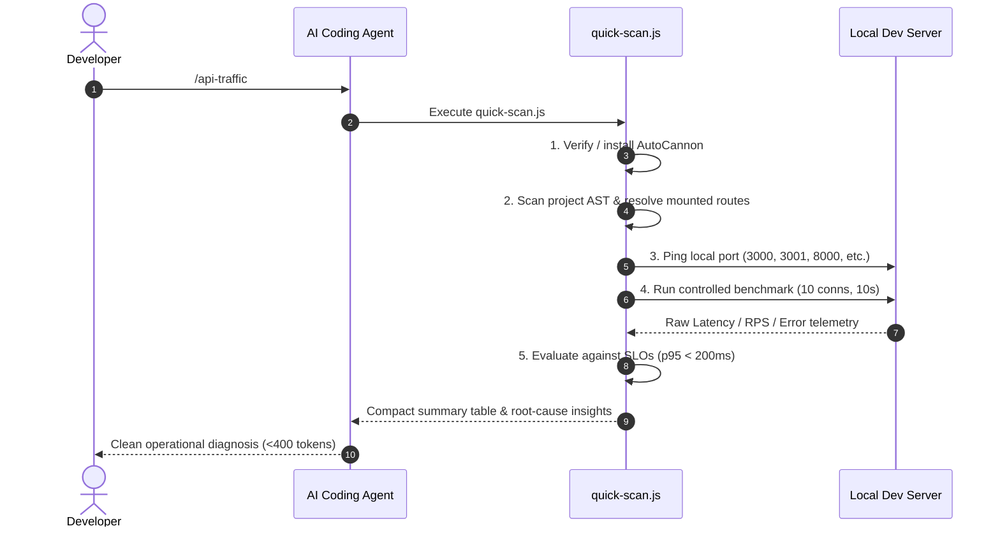

<div align="center">

# 🚦 TrafficLens

**AI-powered API operations & traffic profiling skill for coding agents.**  
Auto-detects backend endpoints, runs controlled AutoCannon benchmarks, and diagnoses latency regressions.

[](https://skills.sh/hemanshulabs/trafficlens)
[](LICENSE)
[]()
[]()

[Installation](#-quick-install) • [How to Use](#-usage) • [Supported Frameworks](#-supported-frameworks) • [Architecture](#-architecture)

</div>

---

## ⚡ Overview

When building and testing APIs, developers often struggle to catch performance regressions before deployment. **TrafficLens** transforms your existing AI coding agent (**Claude Code**, **Cursor**, **Codex**, **Gemini CLI**, or **OpenCode**) into an automated performance engineer:

* 🔍 **Automated Route Discovery**: Extracts backend endpoints and HTTP methods across your codebase without manual configuration.
* ⚡ **Safe Development Load Testing**: Runs controlled, lightweight benchmarks using AutoCannon (default: 10 connections, 10s per route).
* 📊 **Latency Percentiles ($p50$, $p95$, $p99$)**: Measures throughput ($RPS$), status distributions, and error budgets.
* 🛠️ **Actionable Root-Cause Analysis**: Flags SLO violations ($p95 > 200\text{ms}$) and provides file-level fix suggestions in under 400 tokens.

---

## 🚀 Quick Install

### Option 1: Vercel Skills (`skills.sh`) — Recommended

Install into your project or globally across all supported coding agents:

```bash
npx skills@latest add hemanshulabs/trafficlens
```

### Option 2: Claude Code Plugin

Install directly via the Claude Code CLI:

```bash
claude plugins install trafficlens-skills
```

Or execute within an active Claude Code conversation:

```text
/plugin install trafficlens-skills
```

---

## 💻 Usage

Ensure your local backend development server is running (e.g., `npm run dev`), then trigger the skill:

```text
/api-traffic
```

You can also prompt your agent naturally:
* *"Benchmark my API routes and find any slow endpoints."*
* *"Run a load test against the checkout service."*
* *"Are there any endpoints exceeding our 200ms latency budget?"*

---

## 📊 Sample Report

When invoked, TrafficLens evaluates your active server and generates a structured operational report:

### TrafficLens API Performance Report

**Target:** `http://localhost:3000` | **Routes Tested:** 5 | **Load:** 10 connections (10s / route)

| Route | Method | RPS | p50 | p95 | p99 | Errors | Status |
| :--- | :--- | :---: | :---: | :---: | :---: | :---: | :---: |
| `/api/products` | `GET` | 2,410 | 2ms | 6ms | 11ms | 0 | ✅ Healthy |
| `/api/products/:id` | `GET` | 2,890 | 1ms | 4ms | 7ms | 0 | ✅ Healthy |
| `/api/config` | `GET` | 2,120 | 1ms | 5ms | 8ms | 0 | ✅ Healthy |
| `/api/search` | `POST` | 310 | 45ms | 110ms | 185ms | 0 | ✅ Healthy |
| `/api/checkout` | `POST` | 3 | 2.6s | 2.8s | 3.1s | 1 | 🔴 Slow |

### ⚠️ Diagnostic Findings & Recommendations

* **🔴 `POST /api/checkout`** — Latency $p95 = 2.8\text{s}$ exceeds $500\text{ms}$ SLO (+460%)
  * **Probable Cause:** Synchronous blocking payment processing or unindexed database query.
  * **Remediation:** Move order fulfillment to a background task queue or add an index on order lookups.
* **🟡 `GET /api/config`** — High response repetition detected.
  * **Remediation:** Add HTTP `Cache-Control: public, max-age=60` headers to eliminate redundant database hits.

---

## 🧩 Supported Frameworks

TrafficLens automatically detects route definitions and mount paths across major Node.js / TypeScript backend frameworks:

| Framework | Detection Method | Supported Patterns |
| :--- | :--- | :--- |
| **Express & Koa** | Router & AST Analysis | `app.get()`, `router.post()`, `app.use('/api', router)` |
| **Next.js (App Router)** | File-system routing | `app/api/**/route.ts` (GET, POST, PUT, DELETE exports) |
| **Next.js (Pages Router)**| File-system routing | `pages/api/**/*.ts` (handler functions) |
| **Fastify & Hono** | Route declaration | `fastify.get()`, `app.post()` |
| **NestJS** | Controller decorators | `@Get()`, `@Post()`, `@Controller('/path')` |
| **Remix & SvelteKit** | Server loaders & endpoints | `routes/**/*.server.ts`, `+server.ts` |

---

## 🏗️ Architecture



---

## 📂 Repository Structure

```text
Trafficlens/
├── .claude-plugin/
│   ├── plugin.json                 # Claude Code plugin definition
│   └── marketplace.json            # Plugin marketplace metadata
├── skills/
│   └── api-traffic/
│       ├── SKILL.md                # Operational runbook (Phases 1–4)
│       ├── agents/
│       │   └── openai.yaml         # Codex CLI interface configuration
│       ├── scripts/
│       │   ├── quick-scan.js       # All-in-one discovery & benchmark runner
│       │   ├── discover-routes.js  # AST route parser
│       │   └── run-analysis.js     # Benchmark evaluator
│       └── references/
│           └── detection-rules.md  # Production SLO baselines & formulas
├── skills.sh.json                  # Vercel skills.sh grouping configuration
├── SKILL.md                        # Root skill manifest for direct installs
├── package.json                    # Package metadata (0 runtime npm dependencies)
├── README.md                       # Documentation
└── LICENSE                         # MIT License
```

---

## 🛡️ Operational Safeguards

* **Zero Runtime Dependencies**: Written entirely in native Node.js standard modules (`node:fs`, `node:path`, `node:child_process`). Runs instantly on any system with Node.js 18+.
* **Safe Local Concurrency**: Default load tests run with minimal concurrency (`10 connections`, `10 seconds`) to avoid exhausting local database connection pools.
* **Secret Redaction**: Authorization headers, cookies, API keys, and sensitive tokens are automatically masked as `<REDACTED>`.
* **Read-Only**: The skill never modifies application source code without explicit user confirmation.

---

## 📄 License

MIT © [TrafficLens Team](LICENSE)
